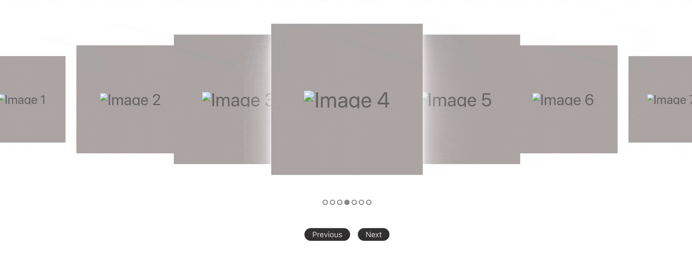

# Image Carousel

A clean and responsive image carousel that displays a series of images with smooth scaling transitions and a subtle sense of depth. Ideal for simple galleries, product showcases, or any use case where a lightweight, distraction-free image slider is needed.

The carousel offers basic configuration options including custom class names, scaling behavior, and image sources—making it easy to adapt visually without introducing complexity.

## Live Demo

The GIF here demonstrates the basic functionality, but the actual carousel transitions are smoother and more fluid.



Note that the carousel also supports **left and right arrow keys**, as well as **indicator dots**, though this GIF shows navigation via the **Previous** and **Next** buttons for clearer visual demonstration.

## What You Can Configure
- Images: Pass your own image list (with src, alt, and width)
- CSS Classes: Customize class names for every element (panels, buttons, indicators)
- Scale Behavior: Adjust how much the focused image grows compared to the rest

## Installation

To install the carousel, run the following command in your terminal:

```bash
npm install @ozenselin/image-carousel
```

## Usage Exemples

### HTML Setup

```html
<div id="my-carousel"></div>
<script src="node_modules/@ozenselin/image-carousel/dist/carousel.min.js"></script>
```

### JavaScript Setup

```javascript
import Carousel from "@ozenselin/image-carousel";

const carousel = Carousel({
  rootElement: document.getElementById("my-carousel"),
  config: {
    images: [
      { src: "image01.jpg", alt: "Image 1" },
      { src: "image02.jpg", alt: "Image 2" },
      { src: "image03.jpg", alt: "Image 3" },
      { src: "image04.jpg", alt: "Image 4" },
      { src: "image05.jpg", alt: "Image 5" },
      { src: "image06.jpg", alt: "Image 6" },
      { src: "image07.jpg", alt: "Image 7" },
    ],
  },
});

carousel.initialize();
```

## Features

- **Dynamic Scaling**: Images grow and shrink with smooth transitions.
- **Shadow Effects**: Depth is added with shadows, enhancing the 3D feel.
- **Multi-Control Navigation**: Navigate using buttons, indicators, or keyboard arrows.
- **Responsive Design**: Optimized for both mobile and desktop devices.
- **Zero Dependencies**: No external libraries required for a lightweight solution.

## API

- `carousel.initialize()` - Starts the carousel.
- `carousel.goToNext()` - Navigate to the next slide.
- `carousel.goToPrevious()` - Navigate to the previous slide.
- `carousel.goToIndex(index)` - Jump to a specific slide.
- `carousel.getCurrentIndex()` - Retrieve the current slide index.
- `carousel.destroy()` - Destroys the carousel and cleans up resources.

## License

This project is licensed under MIT license - see the [LICENSE](LICENSE) file for details.
